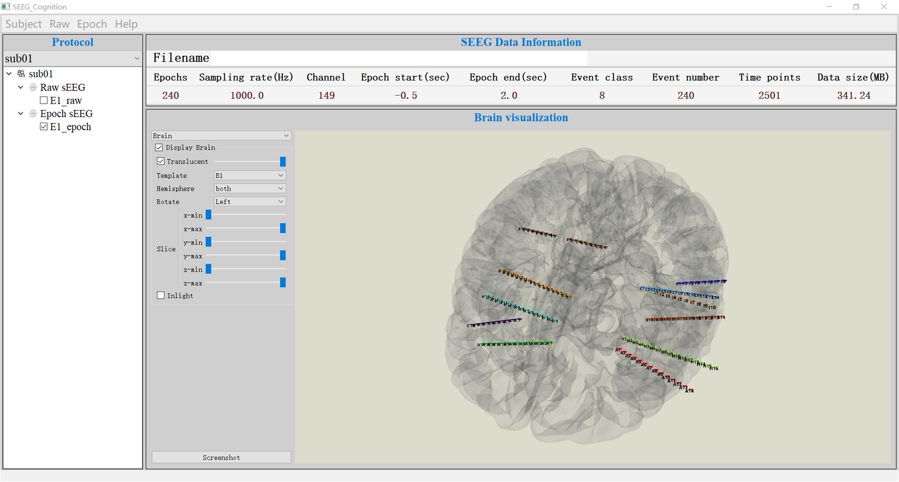

#  Process and Analysis of Cognitive SEEG(PACS) 
## Introduction  



__Process and Analysis of Cognitive SEEG(PACS)__ is a Python-based software aiming to do the pre-processing and analysis of stereo-EEG(SEEG) in neuroscience. It support four main functions: __SEEG data import and export__, __Process of Raw class data__, __Analysis of Epoch class data__, __3D visualization of brain templates and SEEG electrodes__.

## Features

- __Language__: Python
- __OS__: Windows, Linux, MacOS

## Installation Guidance

- Firstly, git clone the repository to your local device.

- Secondly, create a python environment, __conda__ is recommended here. You could just type  

  ```
  conda create -n SEEG python=3.7  
  ```

- Thirdly, use 

   ```
   pip install -r requirements.txt
   ```

  to install all the dependencies needed.

